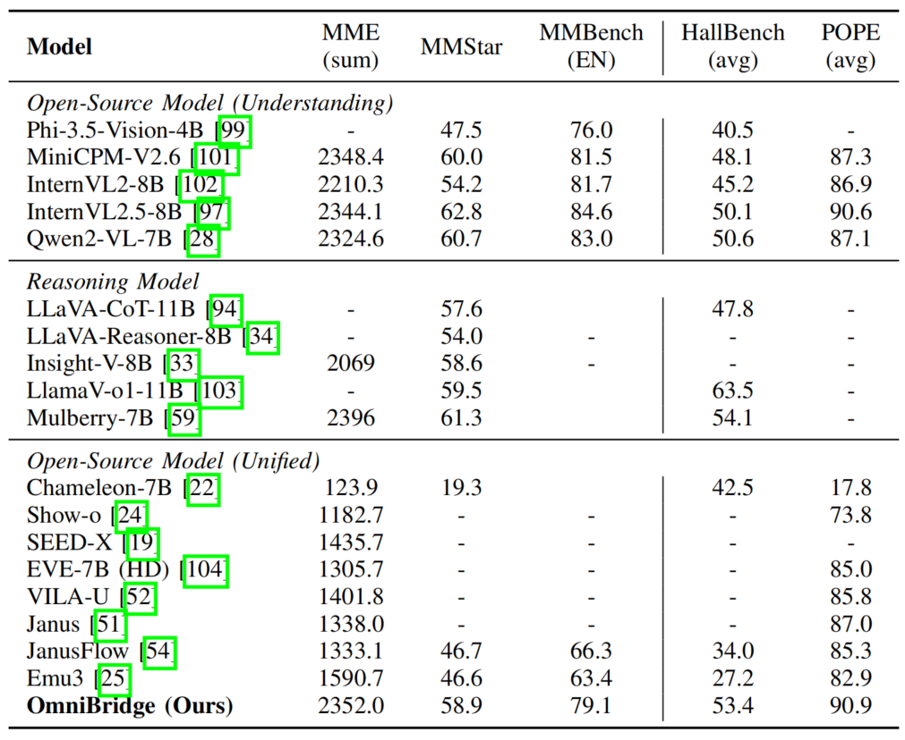

<div align='center'>
<h1>OmniBridge: Unified Multimodal Understanding, Generation, and Retrieval via Latent Space Alignment</h1h1>
<h3></h3>

<!-- [Emu3 Team, BAAI](https://www.baai.ac.cn/english.html) -->

| [Github](https://github.com/xiao-xt/OmniBridge) | [Paper](https://arxiv.org/abs/2509.19018) | [🤗HF Models](https://huggingface.co/collections/) | [Modelscope](https://www.modelscope.cn/models/xxtssr/OmniBridge/summary) | 


</div>

<div align='center'>

</div>


we propose **OmniBridge**, a unified and modular multimodal framework that supports vision-language understanding, generation, and retrieval within a unified architecture. OmniBridge adopts a language-centric design that reuses pretrained LLMs and introduces a lightweight bidirectional latent alignment module for decoupling visual generation, multimodal retrieval, and latent space alignment from the core LLM.

<div align='center'>

</div>


### OmniBridge excels in both generation and perception
**OmniBridge** demonstrate the effectiveness of our framework through extensive experiments on standard vision-language benchmarks, validating that OmniBridge has achieved state-of-the-art or competitive performance in multimodal understanding, generation, and retrieval tasks.

<div align='center'>

</div>

<div align='center'>

</div>

### Highlights

- **OmniBridge** is a unified and modular multimodal framework that supports understanding, generation, and retrieval tasks within a single architecture.
- **OmniBridge** introduce a two-stage decoupled training strategy that separates behavioral alignment from latent-level alignment, enabling efficient and stable adaptation across diverse multimodal tasks
- **OmniBridge** design a novel semantic-guided diffusion training mechanism that gradually replaces text conditioning with learnable query embeddings, enabling fine-grained, controllable latent space alignment.
- **OmniBridge** demonstrate the effectiveness of our framework through extensive experiments on standard vision-language benchmarks, validating that OmniBridge has achieved state-of-the-art or competitive performance in multimodal understanding, generation, and retrieval tasks.


## Performance

### Vision-Language Understanding

#### Multimodal Reasoning and Mathematics

<div align='center'>

</div>


<div align='center'>

</div>


#### OCR, Chart, and Document Understanding

<div align='center'>

</div>

#### Multi-Image Understanding

<div align='center'>

</div>


#### Real-World Comprehension

<div align='center'>

</div>


#### Comprehensive Multimodal Evaluation & Multimodal Hallucination Evaluation

<div align='center'>

</div>

#### Multimodal Understanding Cases

<div align='center'>

</div>

### Image Generation

#### Performance on Geneval banchmark

<div align='center'>

</div>

#### Performance on DPG-Bench 

<div align='center'>

</div>


#### Image Generation Cases

<div align='center'>

</div>

<div align='center'>

</div>


### Image Editing

#### Performance on IMGEDIT-BENCH

<div align='center'>

</div>

#### Image Editing Cases

<div align='center'>

</div>

### Multimodal Retrieval

<div align='center'>

</div>


## News
- 2025.09 We relase **[OmniBridge](https://huggingface.co/)** which is a unified and modular multimodal framework that combines a language-centric design with efficient cross-modal alignment.
- 2025.08 We introduce OmniBridge, a unified and modular multimodal framework that supports vision-language understanding, generation, and retrieval within a unified architecture.


### TODO

- [X] Release model weights of OmniBridge.


### Setup

Clone this repository and install required packages:

```shell
git clone https://github.com/xiao-xt/OmniBridge

pip install -r requirements.txt
```

And you need to download the weights of the Decoder of HunyuanDiT for image generation: https://huggingface.co/Tencent-Hunyuan/HunyuanDiT-v1.2

### Model Weights

| Model name               | HF Weight                                                      | Modelscope                                                                | 
| ------------------------ | -------------------------------------------------------------- | ------------------------------------------------------------------------- | 
| **OmniBridge**          | [🤗 HF link]()          | [Modelscope link]()          |  
| **OmniBridge-Retrieval-Finetuned**            | [🤗 HF link](https://huggingface.co/)            | [Modelscope link](https://www.modelscope.cn/models/xxtssr/OmniBridge/summary)            | 


### Quickstart

#### Use 🤗Transformers to run OmniBridge for vision-language understanding
```shell
python ./multimodal_understanding.py
```

#### Use 🤗Transformers to run OmniBridge for image generation
```shell
python ./image_generation.py
```

#### Use 🤗Transformers to run OmniBridge for image editing
```shell
python ./image_editing.py
```

#### Use 🤗Transformers to run OmniBridge for multimodal retrieval
```shell
python ./multimodal_retrieval.py
```


## Citation

If you find Emu3 useful for your research and applications, please consider starring this repository and citing:

```
@article{xiao2025omnibridge,
  title={OmniBridge: Unified Multimodal Understanding, Generation, and Retrieval via Latent Space Alignment},
  author={Xiao, Teng and Li, Zuchao and Zhang, Lefei},
  journal={arXiv preprint arXiv:2509.19018},
  year={2025}
}
```
